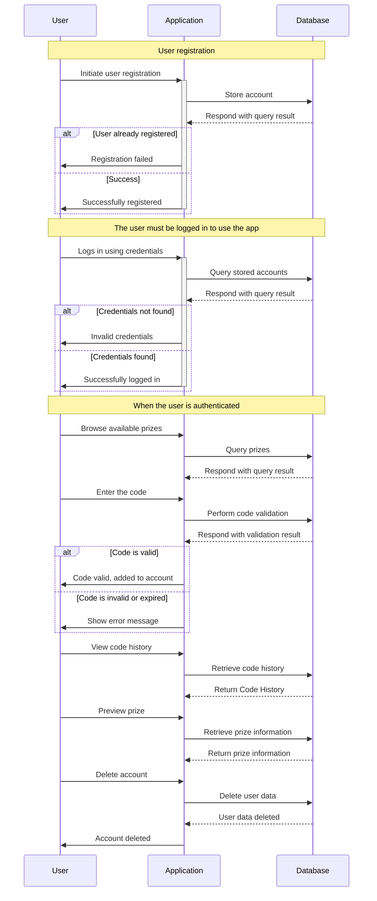

# Code Prize Raffle

This is a Code Prize Raffle app built using `React` and `TypeScript` with `Vite`.

## :scroll: Description

This app was created to provide users with the ability to create profiles, participate in various promotions, and have a chance to win prizes by entering unique codes.

It is designed to provide user interaction and entertainment that allows users to register and log in. After successful login, they have the option to browse available rewards. The navigation includes options for a complete list of rewards, entering codes, managing a user profile, and other functionalities.

When the user clicks on the "Code" button, a modal window opens. They can enter special codes associated with various rewards. After entering the code, the app performs validation of the entered code. If the it's valid, it will be added to the user's account. In case of invalid code or other problems (for example, expired or already registered code), the app provides appropriate messages.

A history of the codes that the user has entered and used is available. In order for the system to function, integration with a database is required to store the information. Clicking on one of the available rewards provides information including title, description, availability, and required amount of codes.

There's also a "menu" of options for the user, including an overview of the user's profile, prizes they've entered, history of codes they've entered, and more. In addition, there is an option to delete their account.

## Chart of the architecture

## :briefcase: Technologies used

- React
- TypeScript
- Cypress
- Vitest
- HTML5
- SCSS
- ESlint
- Vite
- Git
- Bootstrap (incl. `react-bootstrap`)
- Prettier

## :sparkles: Testing

The tests for components are written using `Cypress`, a popular end-to-end testing framework for web apps. Component tests tests individual components of the app, ensuring that each component works as expected.

Unit tests are written with `Vitest`.

## :woman_juggling: Available Scripts

You need to have [NodeJS](https://nodejs.org/en/) installed to run the scripts. To install the dependencies, run `npm install` first.

#### `npm run dev`

Runs the app in the development mode on the local server.
Open [http://localhost:3000](http://localhost:3000) to view it in the browser.

#### `npm test`

Runs all the application tests.

#### `npm run build`

Builds the app for production to the `build` folder.
It correctly compiles the TypeScript code and then creates a production version of the application with Vite that is ready to deploy to a production environment.

#### `npm run ts-validate`

Performs type-checking on the TypeScript files. In combination with the `--noEmit` option the compiler will not generate JavaScript files.

#### `npm run format`

Automatically formats files using prettier.

#### `npm run cy:open-unit`

Opens a graphical user interface for testing web applications in a browser.

#### `npm run cy:run-unit`

Runs Cypress tests to completion. By default, all tests run headlessly.

#### `.env.example`

To set up your app with your own requests and API keys, simply copy the `.env.example` file and rename it to `.env` (or `.env.development` or `.env.production`, based on the environment) then replace the dummy values with real ones.
